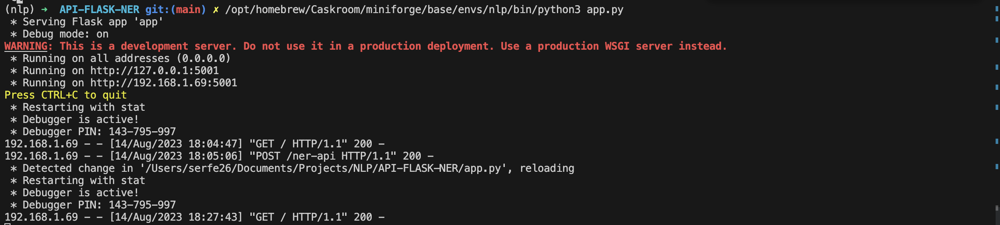
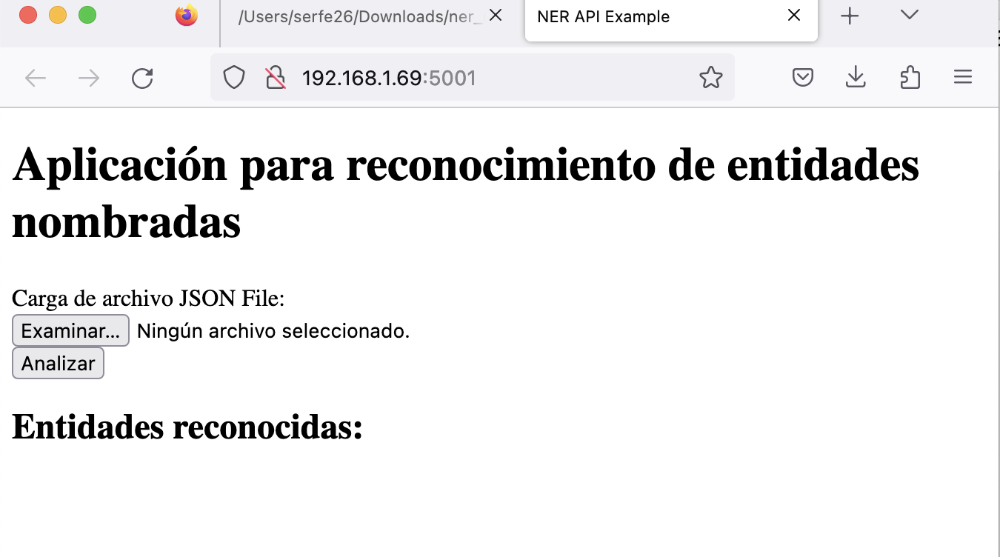
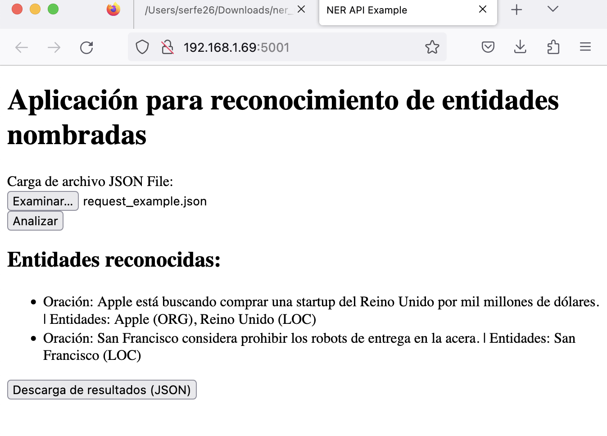
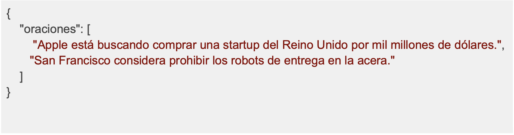
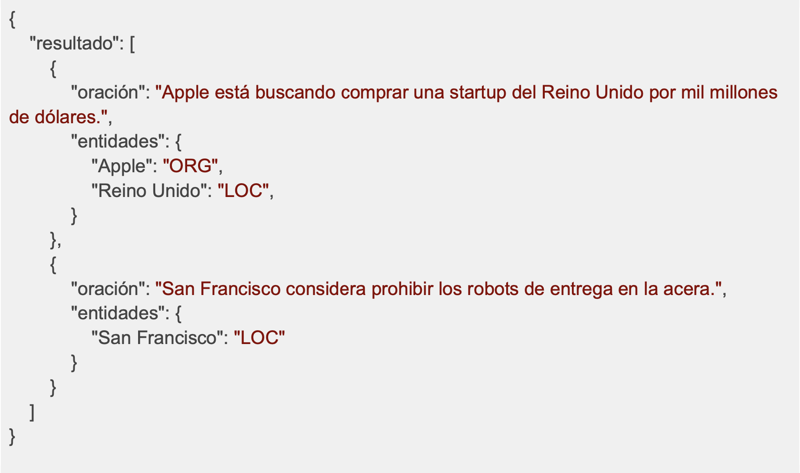

# API-FLASK-NER

## Ejecución 
Ejecutar la siguiente instrucción para ejecutar API
```
python3 app.py
```


## Despliegue de API
Entrar a la dirección [http://127.0.0.1:5001](http://127.0.0.1:5001) o [http://192.168.1.69:5001](http://192.168.1.69:5001) para desplegar aplicación de *Reconocimiento de entidades nombradas*.


## Uso de API

1. Presionar botón `Examinar` para cargar archivo con formato JSON para realizar reconocimiento de entidades. Observar el nombre del archivo, ejemplo: `request_axample.json`.
2. Presionar botón `Analizar` para extraer las entidades reconocidas del archivo proporcionado.

3. Una vez desplegadas las instancias en el apartado **Entidades reconocidas**, presionar botón `Descarga de resultados (JSON)`, esta acción descarga el archibo `ner_output.json`.

## Formatos 
Acepta y despliega archivos en formato JSON con las siguientes características.

### Petición



### Resultados 


## Software
* python 3.11.4

### Bibliotecas 
* spaCy
* flask 